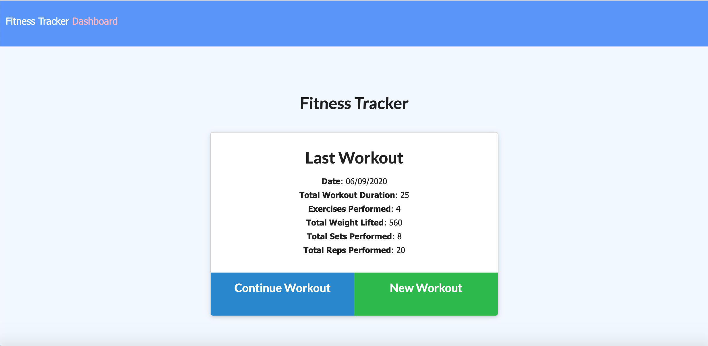

# NoSQL-Fitness-Tracker
An application that enables a user to view, create and keep track of their workouts. Data is stored as a collection in a Mongo database. 

## User Story

 As a user, I want to be able to view, create and track daily workouts. I want to be able to log multiple exercises in a workout on a given day. I should also be able to track the name, type, weight, sets, reps, and duration of exercise. If the exercise is a cardio exercise, I should be able to track my distance traveled.
 I also want to see a visual summary of my workout statistics, including the combined weight of multiple exercises in the stats page. 

 ## Application
 https://nameless-refuge-53137.herokuapp.com/

 
 
 

 